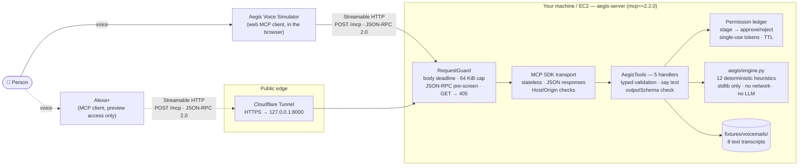
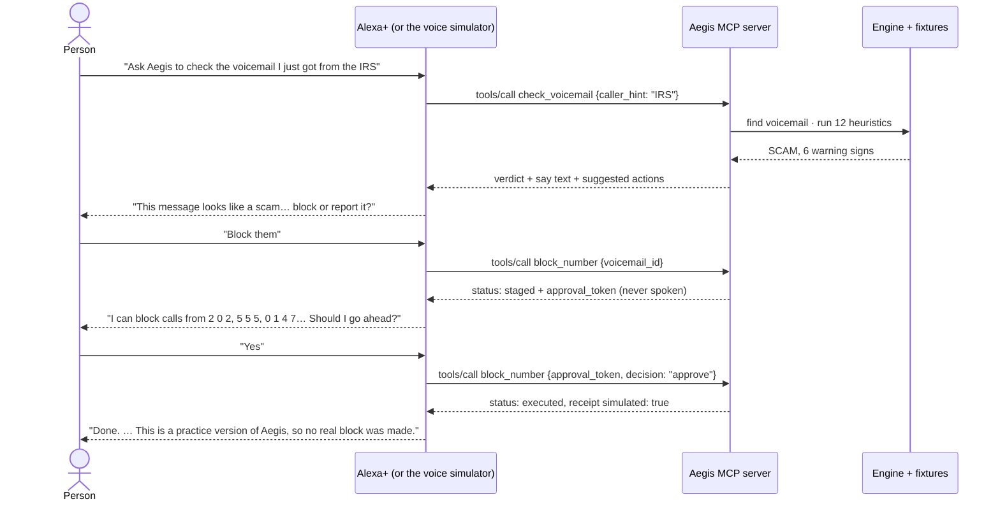
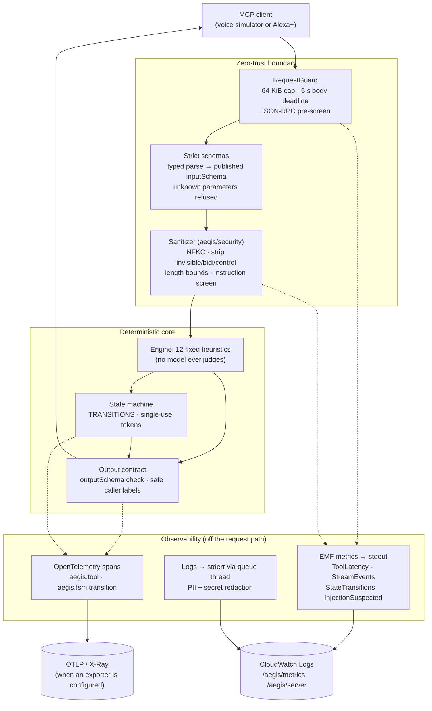

# Aegis: Voice-First Scam Defense on Alexa+

**A shield for older adults and the families who worry about them, built as a self-hosted Alexa+ MCP server.**

**The name:** in Greek myth, the *aegis* was the shield carried by Zeus and Athena, a symbol of protection that's always there. That's the job: Aegis stands between a trusting person and a scammer. It explains the danger in plain words and never acts without a clear "yes".

> "Alexa, ask Aegis to check the voicemail I just got from the IRS."
>
> *"This message looks like a scam. The caller wants payment by gift card, wire transfer or cryptocurrency. Real agencies never ask for that. Would you like me to block this number or report it?"*

Aegis is a self-hosted [Model Context Protocol](https://modelcontextprotocol.io) (MCP) server built for Alexa+ to call over Streamable HTTP. A deterministic engine checks each voicemail and returns a verdict (SCAM, SUSPICIOUS or LEGITIMATE) with plain spoken reasons. If the person asks, Aegis can block the caller or report the call, but only after a read-back and an explicit "yes".

**Try it in two commands.** Amazon's Alexa+ add-on tools are in preview for select partners only, so hackathon entrants can't connect a server to a real Alexa+ device. Aegis therefore ships the **Aegis Voice Simulator**: a web page served by the server itself that is a real MCP client. It sends `initialize`, `tools/list` and `tools/call` over Streamable HTTP, exactly as Alexa+ would, and you talk to it by voice or text. See [Quickstart](#quickstart).


---

## Hackathon track

| | |
|---|---|
| **Event** | Amazon Developer Hackathon "Build, Ship, Shape" |
| **Track** | Alexa+ (self-hosted MCP server, Streamable HTTP, MCP 2025-11-25) |
| **Mini challenges** | None entered |
| **Deadline** | 2026-10-23, 12:00 PT |
| **Pitch video** | 2:45 pitch: [`docs/PITCH_SCRIPT.md`](docs/PITCH_SCRIPT.md). Recording steps: [`docs/RECORDING_GUIDE.md`](docs/RECORDING_GUIDE.md) |
| **Demo** | One spoken sentence: *"Check the voicemail I just got from the IRS."* Then why it's a scam, a read-back, and a "yes"-gated block, in the Aegis Voice Simulator with the live MCP traffic beside it. |
| **Try it** | `pip install -e ".[dev]"`, then `aegis-server` and open <http://127.0.0.1:8000>. No accounts, keys or hosting needed. |
| **Alexa+ access** | The Alexa+ MCP Toolkit, CLI and web simulator are preview-only (hackathon FAQ), so the demo uses our own web MCP client, the path the FAQ describes. The add-on kit for a real deploy is ready in [`docs/ALEXA_DEPLOY.md`](docs/ALEXA_DEPLOY.md) for when access opens. |
| **Product feedback** | [`AMAZON_DEVELOPER_FEEDBACK.md`](AMAZON_DEVELOPER_FEEDBACK.md): the 5-question framework for every tool used (Alexa+ MCP Toolkit, MCP Python SDK, Builder Tools MCP). Evidence: [`docs/developer_feedback.md`](docs/developer_feedback.md) |
| **Devpost text** | [`docs/DEVPOST_DESCRIPTION.md`](docs/DEVPOST_DESCRIPTION.md) |

## Built With

| | Tool | What Aegis uses it for | Status |
|---|---|---|---|
| ⭐ **Track tool** | **Alexa+ MCP server over Streamable HTTP** (Alexa+ MCP Toolkit) | Five voice tools: check, explain, list, block and report voicemails. Stateless JSON-RPC over Streamable HTTP, MCP 2025-11-25 (2025-03-26 also accepted), with a propose → approve → execute gate. | Built and tested (336 tests, 23 HTTP smoke checks). Add-on manifest, icons, and privacy and terms pages ready for when Alexa+ preview access opens. |
| | **Aegis Voice Simulator** (web MCP client) | Demoing and testing end to end: speech in and out in the browser, and every JSON-RPC message shown live | Built and tested, served at `/simulator` |
| | Alexa AI CLI and Alexa+ web simulator | Deploying to the development stage | Not available to hackathon entrants (preview, select partners). Kit ready: [`docs/ALEXA_DEPLOY.md`](docs/ALEXA_DEPLOY.md) |
| | MCP Python SDK `2.2.0` | The protocol implementation under the server | In use, hardened (see [Security notes](#security-notes)) |
| Dev tools | Amazon Devices Builder Tools MCP | Reading Amazon's docs from inside our coding agent | Used throughout the build |
| Runtime | Python 3.12, uvicorn, Starlette, jsonschema, OpenTelemetry API | Server, validation, tracing | Pinned in `pyproject.toml` |

### Design principles
- **No AI verdicts.** Verdicts come only from 12 fixed, weighted heuristics in `aegis/engine.py`. The engine is standard-library only, with no network and no LLM, and tests enforce that. Alexa+ handles the conversation; Aegis decides the risk.
- **Nothing happens without a "yes".** Blocking and reporting go propose → approve → execute. Each action is staged first, and approving it needs a single-use token. A wrong, reused or expired token is refused. The block tool can't approve a staged report.
- **Speech-first.** Every result carries a short `say` sentence written to be read aloud. It never includes IDs, tokens, jargon or references to a screen, and offers at most 5 options.

### What it doesn't do yet
- **Actions are simulated.** Receipts carry `simulated: true`, and Alexa says so. Nothing is really blocked or reported.
- **Voicemails are 8 scripted text fixtures** (5 scam, 3 legitimate), not audio.
- **English only.** Caller metadata is trusted.
- **Pending approvals live in memory** and vanish on restart.
- **The demo client isn't Alexa+.** The voice simulator picks a tool with a simple phrase matcher where Alexa+ would use its language model, and reads Aegis's `say` text in the browser's voice. Everything it says comes from the server.
- **No authentication** on the endpoint. This is a recorded hackathon decision; see [Security notes](#security-notes).

---

## System topology



**How to read it:**
- **The demo client is the Aegis Voice Simulator.** It runs in the browser, is served by the server itself, and speaks the same MCP that Alexa+ does.
- **Alexa+ is the intended client** (dotted lines). It would handle speech and conversation, and reach the server over HTTPS through a Cloudflare tunnel. Connecting it needs preview access that hackathon entrants can't get.
- **Aegis decides the risk.** Every verdict comes from the deterministic engine; no language model judges a voicemail.

### The demo, step by step



### Tools

| Tool | What it does | Changes state? |
|---|---|---|
| `list_voicemails` | Newest first, up to 5 per page, with a `next_cursor` | No |
| `check_voicemail` | Verdict and top 3 warning signs. Finds the voicemail by ID, by the caller's description ("IRS", "I.R.S.", "the bank", "my grandson", part of a number), or picks the newest. | No |
| `explain_red_flags` | Plain-English warning signs, up to 5 per turn, with `next_start` | No |
| `block_number` | Two calls: stage (read-back plus token), then `approve` or `reject` | Yes, simulated |
| `report_scam` | Same two-call flow, and reads back the verdict first | Yes, simulated |

The full protocol spec (schemas, error model, state machines) is in [`docs/architecture.md`](docs/architecture.md).

---

## Experimental extras (not part of the Alexa+ submission)

The repo also contains a **simulator-only** ambient pipeline: a doorbell event plus consented visitor speech produces a TV alert card, scored by the same deterministic engine. It's **off by default** (its endpoints exist only when `AEGIS_WEBHOOK_SECRET` and `AEGIS_DISPLAY_TOKEN` are set), it isn't connected to real Ring, Bee or Fire TV devices, and it isn't part of this Alexa+ track entry. Details: [`docs/ecosystem.md`](docs/ecosystem.md). There's also an AWS hosting design in [`docs/aws_bedrock_integration.md`](docs/aws_bedrock_integration.md) (not deployed).

## Quickstart

### Prerequisites
- **Python 3.12 or later.** The code uses 3.12 syntax. macOS's system `python3` is often 3.9 and won't work. Install 3.12 from [python.org](https://www.python.org/downloads/), with Homebrew (`brew install python@3.12`), or with [uv](https://docs.astral.sh/uv/) (`uv python install 3.12`).
- **A browser** for the voice simulator. Speech input works in Chrome, Edge and Safari; you can always type instead.
- *Optional:* **[cloudflared](https://developers.cloudflare.com/cloudflare-one/connections/connect-networks/downloads/)**, only to reach the server from outside your machine.

### 1. Install

```bash
git clone https://github.com/utlityapps/aegis-mcp.git
cd aegis-mcp
python3.12 -m venv .venv
source .venv/bin/activate
pip install -e ".[dev]"
```

This installs the pinned runtime dependencies (`mcp==2.2.0`, `uvicorn==0.54.0`, `starlette==1.7.0`, `jsonschema==4.26.0`) and `pytest`.

### 2. Run the tests

```bash
pytest tests/ -q                 # 336 tests: engine, handlers, hardening, stress, resilience, ecosystem, telemetry/security
python server/smoke_test.py      # 23 end-to-end checks over real HTTP (starts its own server)
```

| Suite | Covers |
|---|---|
| `tests/test_aegis.py` | Heuristics, verdict thresholds, fixture verdicts, the permission ledger, the no-network guarantee |
| `tests/test_tools.py` | All 5 tools against their `outputSchema`, input rules, the approve/reject/expiry/rotation flows |
| `tests/test_hardening.py` | Request guard (stalled or oversized bodies, disconnects), cursor and token edge cases, bind policy |
| `tests/test_resilience.py` | State-machine transitions, the double validation gate, forced timeouts, malformed streams, cache hits, prefetch, queued logging |
| `tests/test_ecosystem.py` | Ring/wearable/card schemas, HMAC signing and replay, the visit state machine, consent and no-transcript rules, SSE delivery, the end-to-end chain under 200 ms |
| `tests/test_telemetry_security.py` | EMF format and dimension allowlist, metrics per tool/stream/transition, OpenTelemetry spans, log redaction and stdout/stderr routing, sanitizer and injection screening |
| `tests/test_alexa_addon.py` | The add-on manifest meets every QuickStart constraint; assets exist at their declared sizes; the privacy and terms URLs resolve; the privacy policy matches the code |
| `tests/test_simulator.py` | Voice simulator: strict headers, only its own origin may call `/mcp`, the phrase matcher, and the full demo conversation against a live server at both protocol versions (needs `node`) |
| `tests/test_display.py` | Experimental TV display page: strict headers, text-only rendering |
| `tests/test_stress.py` | Invalid JSON-RPC ids, non-object arguments, half-closed connections, spelled-out acronyms, schema-limit data |
| `server/smoke_test.py` | Handshake at `2025-03-26` and `2025-11-25`, the demo flow, error contracts, 405/413/403/400/202 transport behavior |

### 3. Run the server locally

```bash
aegis-server                     # or: python -m server
# → Aegis MCP server on http://127.0.0.1:8000/mcp (stateless=True, voicemails=8, approval_ttl=600s)
# → voice simulator on http://127.0.0.1:8000/simulator
```

| Flag / env var | Default | Purpose |
|---|---|---|
| `--host` / `AEGIS_HOST` | `127.0.0.1` | Bind address. A non-loopback address is **refused** unless `--allow-remote-bind` is set. |
| `--port` / `AEGIS_PORT` | `8000` | Port |
| `--stateless` / `--no-stateless` | stateless | Serve without MCP sessions |
| `--simulator` / `--no-simulator` | on | Serve the voice simulator page and allow its own origin to call `/mcp` |
| `--allow-remote-bind` / `AEGIS_ALLOW_REMOTE_BIND=1` | off | Permit a public bind; only behind a trusted proxy |
| `AEGIS_ALLOWED_HOSTS` | *(none)* | Extra `Host` header values to accept, comma-separated (e.g. your tunnel hostname) |
| `AEGIS_APPROVAL_TTL_SECONDS` | `600` | How long a staged action waits for a yes (60–3600) |

Try it by hand:

```bash
curl -s http://127.0.0.1:8000/mcp \
  -H 'Content-Type: application/json' \
  -H 'Accept: application/json, text/event-stream' \
  -d '{"jsonrpc":"2.0","id":1,"method":"tools/call",
       "params":{"name":"check_voicemail","arguments":{"caller_hint":"IRS"}}}'
```

### 4. Talk to it in the voice simulator

Open <http://127.0.0.1:8000> in a browser. The top bar should read *Connected to Aegis 0.1.0 · MCP 2025-11-25 · 5 tools*.

1. Click 🎤 and say *"Check the voicemail I just got from the IRS"*, or click that phrase under **Try saying**. You'll hear: *"This message looks like a scam…"*
2. Then *"Why does it look like a scam?"*, *"Block them"* and *"Yes"*.
3. Watch the **MCP traffic** panel: each turn is one `tools/call` request and its response. The approval token goes back to the server but is never shown in the chat or spoken.

Switch **Protocol** to `2025-03-26` to reconnect with the handshake version in Amazon's Alexa+ sample. **New conversation** clears the page's memory. Restart the server to clear Aegis's state, since a blocked number stays blocked until then.

### 5. Optional: expose it with a Cloudflare tunnel

Alexa+, or anyone outside your machine, needs a public HTTPS URL. A quick tunnel forwards one to your local server without opening any ports:

```bash
cloudflared tunnel --url http://127.0.0.1:8000 --http-host-header 127.0.0.1:8000
# → https://<random-words>.trycloudflare.com
```

- **Why `--http-host-header`:** the server only accepts known `Host` headers, to protect against DNS rebinding, and answers anything else with `421 Misdirected Request`. This flag makes cloudflared send `Host: 127.0.0.1:8000` to the server, which is already allowed.
- **If you'd rather keep the public hostname,** omit the flag and start the server with it allowed instead:

  ```bash
  AEGIS_ALLOWED_HOSTS=<random-words>.trycloudflare.com aegis-server
  ```

- **Keep the server on `127.0.0.1`.** The tunnel connects from the same machine, so `--allow-remote-bind` isn't needed.

Check the tunnel from anywhere:

```bash
curl -s https://<random-words>.trycloudflare.com/mcp \
  -H 'Content-Type: application/json' -H 'Accept: application/json, text/event-stream' \
  -d '{"jsonrpc":"2.0","id":1,"method":"initialize","params":{"protocolVersion":"2025-03-26",
       "capabilities":{},"clientInfo":{"name":"check","version":"1"}}}'
# → … "protocolVersion":"2025-03-26" … "serverInfo":{"name":"aegis" …
```

A quick-tunnel URL changes every time cloudflared starts. For a stable URL, set up a [named tunnel](https://developers.cloudflare.com/cloudflare-one/connections/connect-networks/get-started/) on your own domain.

> Tested end to end on 2026-10-05 through a quick tunnel: both handshake versions, all 5 tools, a median round trip of about 52 ms, and a foreign `Origin` refused with 403.

### 6. Connect it to Alexa+ (needs preview access)

Hackathon entrants can't do this step: the Alexa AI CLI and Amazon's web simulator are in preview for select partners. The kit is ready for when access opens. The full walkthrough (access check, CLI setup, tunnel, manifest, deploy, simulator test) is in [`docs/ALEXA_DEPLOY.md`](docs/ALEXA_DEPLOY.md). In short:

```bash
scripts/demo_up.sh                                   # server on :8766 plus read-only health checks
cloudflared tunnel --url http://127.0.0.1:8766 --http-host-header 127.0.0.1:8766
alexa-ai new mcp --name "Aegis" --locale en-US --mcp-server-url "https://<tunnel-host>/mcp"
.venv/bin/python scripts/render_addon.py --mcp-url "https://<tunnel-host>/mcp"   # fills addon.json, validates it
cd addon-package && alexa-ai deploy                  # then: web simulator, Mode: Isolation
```

The manifest's listing text, the six icons and the carousel image (`alexa/`), and the privacy and terms pages ([`docs/PRIVACY.md`](docs/PRIVACY.md), [`docs/TERMS.md`](docs/TERMS.md)) are ready. Alexa+ reads the tool list only when you deploy, so redeploy whenever the tools or the tunnel URL change.

---

## Repository layout

```
aegis/                  engine (stdlib only)
  security/             text normalization, instruction screening, PII redaction for logs
  telemetry/            CloudWatch EMF metric lines
  engine.py             12 heuristics, verdicts, ActionLedger (staged actions, single-use tokens)
  voicemails.py         fixture loading, deterministic caller lookup (synonyms, spelled-out acronyms)
server/                 MCP server (the only place third-party packages are allowed)
  server.py             transport, RequestGuard, JSON-RPC pre-screen, output-schema check, CLI
  tools.py              the 5 tool handlers
  schemas.py            tool definitions exactly as specified
  validation.py         typed argument parsing
  speech.py             senior-friendly say text
  smoke_test.py         end-to-end HTTP checks
  observability.py      OpenTelemetry spans + EMF metric names
  simulator/            Aegis Voice Simulator: the web MCP client page served at /simulator
  ecosystem/            experimental, off by default: simulated doorbell -> TV alert pipeline
alexa/                  Alexa+ add-on kit: addon.template.json, icons and carousel image
infrastructure/         IAM policy designs for an AWS deployment (not deployed)
scripts/
  demo_up.sh / demo_down.sh     start or stop the server with read-only health checks
  render_addon.py               fill in and validate addon.json for `alexa-ai deploy`
  make_alexa_assets.py          regenerate the add-on icons and carousel image
  demo_voice_flow.py            terminal stand-in client for rehearsals (the voice simulator replaces it)
  simulate_ecosystem_event.py   experimental doorbell -> TV pipeline simulator
fixtures/voicemails/    8 scripted voicemails (5 scam, 3 legitimate)
tests/                  pytest suites
docs/
  architecture.md               protocol spec: tools, schemas, errors, state machines
  aws_bedrock_integration.md    Strands + Bedrock, DynamoDB state, EC2 behind an ALB (design)
  developer_feedback.md         feedback evidence per tool (doc quotes, reproductions)
  ecosystem.md                  experimental ambient pipeline (not part of the submission)
  ALEXA_DEPLOY.md               deploy to Alexa+ once preview access is granted (not available to entrants)
  PITCH_SCRIPT.md               2:45 pitch video script
  RECORDING_GUIDE.md            step-by-step recording walkthrough for the pitch
  DEVPOST_DESCRIPTION.md        project text for the Devpost submission form
  PRIVACY.md / TERMS.md         privacy policy and terms of use (linked from the add-on listing)
pyproject.toml          dependencies and the [tool.aegis] product agreements
AMAZON_DEVELOPER_FEEDBACK.md  5-question product feedback for every tool used
```

---

## Zero-Trust Security & Enterprise Observability

Every request crosses the same boundaries in the same order. Telemetry is emitted at each stage, and never blocks the response or carries personal data.



**Security**
- **Strict input:** arguments are parsed into typed values, re-checked against the published `inputSchema`, and refused if they contain anything unexpected. Nothing reaches the ledger until both checks pass.
- **Text normalization:** NFKC folds look-alike characters, and invisible, bidi and control characters are stripped. "ｇｉｆｔ ｃａｒｄｓ" and "gift\u200bcards" can't slip past the heuristics.
- **Instruction screening:** caller hints that read like instructions to an AI are refused. A caller ID name, which a scammer controls, is replaced with the spoken number before any model sees it.
- **What screening can't do:** pattern lists can't catch every prompt injection. The real defence is structural: verdicts come from fixed rules, and every action needs a human "yes".
- **PII redaction where it's safe:** phone numbers, emails, SSNs, Luhn-valid card numbers, GitHub tokens, AWS keys and bearer tokens are scrubbed from **logs**. They're deliberately *not* stripped from tool arguments, because "555-0147" is how a person names a caller.

**Observability**
- **EMF metrics** (`aegis/telemetry`) go out as one JSON line each on stdout. CloudWatch extracts them without `PutMetricData`. Dimensions come from an allowlist (`Tool`, `Status`, `Stream`, `Outcome`, `Kind`, `From`, `To`, `Model`, `Service`), so ids, numbers and tokens can't become dimensions.
- **OpenTelemetry spans** use the API that `mcp` already depends on. They cost nothing until you install `opentelemetry-sdk` and an exporter.
- **Logs** go through a queue to a background thread: human-readable and redacted on stderr, EMF-only on stdout.
- **Getting it to AWS:** least-privilege IAM policies and shipping notes are in [`infrastructure/`](infrastructure/README.md). On AWS Lambda, CloudWatch reads EMF from stdout natively. On EC2, a log shipper has to send it flagged as EMF.

## Security notes

- **Secrets: audited 2026-10-05.** `.env`, `.env.*` (including the generated `.env.demo`), `logs/` and local assistant settings are git-ignored. No keys or tokens are hardcoded; test files use obvious placeholders. A scan of the working tree and the **full git history** for GitHub, AWS, Slack and private-key patterns found nothing. The experimental pipeline's demo secrets (`.env.demo`) are git-ignored too.
- **No authentication.** Anyone with the tunnel URL can call the tools. That's acceptable only because every action is simulated and the data is fixture-only. Real blocking or reporting needs OAuth 2.1 account linking first, the only auth Alexa+ supports.
- **Built-in protections:**
  - loopback-only bind by default;
  - Host and Origin checks (the only browser origin allowed is the server's own simulator page);
  - a 64 KiB body cap, a 5 s body-read deadline and a 3 s limit per tool call;
  - a cap of 128 concurrent connections;
  - single-use, hashed approval tokens with an expiry;
  - no tokens, cursors or transcripts in the logs.
- **Before anything beyond a demo,** put a rate limit in front of the server: a Cloudflare rule, or AWS WAF on an ALB.

## License

MIT. See [`LICENSE`](LICENSE).
