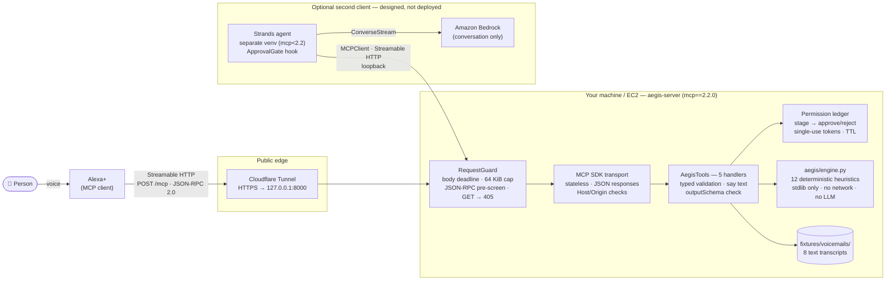
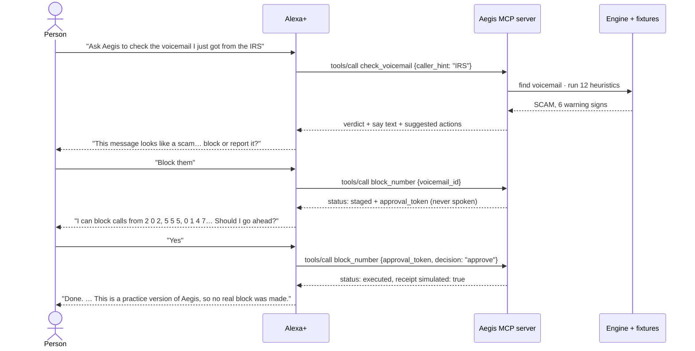

# Aegis

**A voice-native voicemail scam-defense companion for older adults, on Alexa+.**

> "Alexa, ask Aegis to check the voicemail I just got from the IRS."
>
> *"This message looks like a scam. The caller wants payment by gift card, wire transfer or cryptocurrency. Real agencies never ask for that. Would you like me to block this number or report it?"*

Aegis is a self-hosted [Model Context Protocol](https://modelcontextprotocol.io) (MCP) server that Alexa+ calls over Streamable HTTP. A deterministic engine checks each voicemail and returns a verdict (SCAM, SUSPICIOUS or LEGITIMATE) with plain spoken reasons. If the person asks, Aegis can block the caller or report the call, but only after a read-back and an explicit "yes".

---

## Hackathon track

| | |
|---|---|
| **Event** | Amazon Developer Hackathon "Build, Ship, Shape" |
| **Track** | Alexa+ |
| **Deadline** | 2026-10-23, 12:00 PT |
| **Demo** | One voice request, no typing: *"Alexa, ask Aegis to check the voicemail I just got from the IRS."* |
| **Submission extras** | Product feedback brief: [`docs/developer_feedback.md`](docs/developer_feedback.md) |

### Design principles
- **No AI verdicts.** Verdicts come only from 12 fixed, weighted heuristics in `aegis/engine.py`. The engine is standard-library only, with no network and no LLM, and tests enforce that. Alexa+ handles the conversation; Aegis decides the risk.
- **Nothing happens without a "yes".** Blocking and reporting go propose → approve → execute. Each action is staged first, and approving it needs a single-use token. A wrong, reused or expired token is refused. The block tool can't approve a staged report.
- **Speech-first.** Every result carries a short `say` sentence written to be read aloud. It never includes IDs, tokens, jargon or references to a screen, and offers at most 5 options.

### What it doesn't do yet
- **Actions are simulated.** Receipts carry `simulated: true`, and Alexa says so. Nothing is really blocked or reported.
- **Voicemails are 8 scripted text fixtures** (5 scam, 3 legitimate), not audio.
- **English only.** Caller metadata is trusted.
- **Pending approvals live in memory** and vanish on restart.
- **No authentication** on the endpoint. This is a recorded hackathon decision; see [Security notes](#security-notes).

---

## System topology



**How to read it:**
- **Alexa+ is the production client.** It reaches the server through a Cloudflare tunnel during development, or an Application Load Balancer on AWS.
- **Bedrock and Strands sit beside Alexa+, not between the server and the engine.** A Strands agent is a second MCP client that uses Bedrock for conversation and calls the same five tools. Verdicts still come only from the engine, so the model never decides risk. The Strands MCP client has been tested against this server; Bedrock calls and the AWS deployment are designed but not built. See [`docs/aws_bedrock_integration.md`](docs/aws_bedrock_integration.md).

### The demo, step by step



### Tools

| Tool | What it does | Changes state? |
|---|---|---|
| `list_voicemails` | Newest first, up to 5 per page, with a `next_cursor` | No |
| `check_voicemail` | Verdict and top 3 warning signs. Finds the voicemail by ID, by the caller's description ("IRS", "I.R.S.", "the bank", "my grandson", part of a number), or picks the newest. | No |
| `explain_red_flags` | Plain-English warning signs, up to 5 per turn, with `next_start` | No |
| `block_number` | Two calls: stage (read-back plus token), then `approve` or `reject` | Yes, simulated |
| `report_scam` | Same two-call flow, and reads back the verdict first | Yes, simulated |

The full protocol spec (schemas, error model, state machines) is in [`docs/architecture.md`](docs/architecture.md).

---

## Quickstart

### Prerequisites
- **Python 3.12 or later.** The code uses 3.12 syntax. macOS's system `python3` is often 3.9 and won't work. Install 3.12 from [python.org](https://www.python.org/downloads/), with Homebrew (`brew install python@3.12`), or with [uv](https://docs.astral.sh/uv/) (`uv python install 3.12`).
- **[cloudflared](https://developers.cloudflare.com/cloudflare-one/connections/connect-networks/downloads/)**, only to reach the server from Alexa+.

### 1. Install

```bash
git clone https://github.com/utilityapps/aegis-mcp.git
cd aegis-mcp
python3.12 -m venv .venv
source .venv/bin/activate
pip install -e ".[dev]"
```

This installs the pinned runtime dependencies (`mcp==2.2.0`, `uvicorn==0.54.0`, `starlette==1.7.0`, `jsonschema==4.26.0`) and `pytest`.

### 2. Run the tests

```bash
pytest tests/ -q                 # 163 tests: engine, handlers, hardening, stress regressions
python server/smoke_test.py      # 22 end-to-end checks over real HTTP (starts its own server)
```

| Suite | Covers |
|---|---|
| `tests/test_aegis.py` | Heuristics, verdict thresholds, fixture verdicts, the permission ledger, the no-network guarantee |
| `tests/test_tools.py` | All 5 tools against their `outputSchema`, input rules, the approve/reject/expiry/rotation flows |
| `tests/test_hardening.py` | Request guard (stalled or oversized bodies, disconnects), cursor and token edge cases, bind policy |
| `tests/test_stress.py` | Invalid JSON-RPC ids, non-object arguments, half-closed connections, spelled-out acronyms, schema-limit data |
| `server/smoke_test.py` | Handshake at `2025-03-26` and `2025-11-25`, the demo flow, error contracts, 405/413/403/400/202 transport behavior |

### 3. Run the server locally

```bash
aegis-server                     # or: python -m server
# → Aegis MCP server on http://127.0.0.1:8000/mcp (stateless=True, voicemails=8, approval_ttl=600s)
```

| Flag / env var | Default | Purpose |
|---|---|---|
| `--host` / `AEGIS_HOST` | `127.0.0.1` | Bind address. A non-loopback address is **refused** unless `--allow-remote-bind` is set. |
| `--port` / `AEGIS_PORT` | `8000` | Port |
| `--stateless` / `--no-stateless` | stateless | Serve without MCP sessions |
| `--allow-remote-bind` / `AEGIS_ALLOW_REMOTE_BIND=1` | off | Permit a public bind; only behind a trusted proxy |
| `AEGIS_ALLOWED_HOSTS` | *(none)* | Extra `Host` header values to accept, comma-separated (e.g. your tunnel hostname) |
| `AEGIS_APPROVAL_TTL_SECONDS` | `600` | How long a staged action waits for a yes (60–3600) |

Try it by hand:

```bash
curl -s http://127.0.0.1:8000/mcp \
  -H 'Content-Type: application/json' \
  -H 'Accept: application/json, text/event-stream' \
  -d '{"jsonrpc":"2.0","id":1,"method":"tools/call",
       "params":{"name":"check_voicemail","arguments":{"caller_hint":"IRS"}}}'
```

### 4. Expose it to Alexa+ with a Cloudflare tunnel

Alexa+ needs a public HTTPS URL. A quick tunnel forwards one to your local server without opening any ports:

```bash
cloudflared tunnel --url http://127.0.0.1:8000 --http-host-header 127.0.0.1:8000
# → https://<random-words>.trycloudflare.com
```

- **Why `--http-host-header`:** the server only accepts known `Host` headers, to protect against DNS rebinding, and answers anything else with `421 Misdirected Request`. This flag makes cloudflared send `Host: 127.0.0.1:8000` to the server, which is already allowed.
- **If you'd rather keep the public hostname,** omit the flag and start the server with it allowed instead:

  ```bash
  AEGIS_ALLOWED_HOSTS=<random-words>.trycloudflare.com aegis-server
  ```

- **Keep the server on `127.0.0.1`.** The tunnel connects from the same machine, so `--allow-remote-bind` isn't needed.

Check the tunnel from anywhere:

```bash
curl -s https://<random-words>.trycloudflare.com/mcp \
  -H 'Content-Type: application/json' -H 'Accept: application/json, text/event-stream' \
  -d '{"jsonrpc":"2.0","id":1,"method":"initialize","params":{"protocolVersion":"2025-03-26",
       "capabilities":{},"clientInfo":{"name":"check","version":"1"}}}'
# → … "protocolVersion":"2025-03-26" … "serverInfo":{"name":"aegis" …
```

A quick-tunnel URL changes every time cloudflared starts. For a stable URL, set up a [named tunnel](https://developers.cloudflare.com/cloudflare-one/connections/connect-networks/get-started/) on your own domain.

> The server-side half of this was tested: a foreign `Host` is refused with 421, and `AEGIS_ALLOWED_HOSTS` admits it. `cloudflared` itself wasn't available in the build environment, so verify the tunnel step on your machine.

### 5. Connect it to Alexa+

These steps follow Amazon's [Alexa+ MCP QuickStart](https://developer.amazon.com/en-US/docs/alexaplus/add-ons/mcp-toolkit-quickstart.html):

```bash
alexa-ai configure                     # Login with Amazon
alexa-ai new mcp --name "Aegis" --locale en-US \
  --mcp-server-url "https://<random-words>.trycloudflare.com/mcp"
# edit addon-package/addon.json: descriptions, example phrases, privacy/terms URLs, icons
alexa-ai deploy                        # then test in the Alexa web simulator
```

Alexa+ reads the tool list only when you deploy. Run `alexa-ai deploy` again whenever the tools change, or when the tunnel URL changes.

---

## Repository layout

```
aegis/                  engine (stdlib only)
  engine.py             12 heuristics, verdicts, ActionLedger (staged actions, single-use tokens)
  voicemails.py         fixture loading, deterministic caller lookup (synonyms, spelled-out acronyms)
server/                 MCP server (the only place third-party packages are allowed)
  server.py             transport, RequestGuard, JSON-RPC pre-screen, output-schema check, CLI
  tools.py              the 5 tool handlers
  schemas.py            tool definitions exactly as specified
  validation.py         typed argument parsing
  speech.py             senior-friendly say text
  smoke_test.py         end-to-end HTTP checks
fixtures/voicemails/    8 scripted voicemails (5 scam, 3 legitimate)
tests/                  pytest suites
docs/
  architecture.md               protocol spec: tools, schemas, errors, state machines
  aws_bedrock_integration.md    Strands + Bedrock, DynamoDB state, EC2 behind an ALB (design)
  developer_feedback.md         Amazon Developer product feedback brief
pyproject.toml          dependencies and the [tool.aegis] product agreements
```

---

## Security notes

- **No authentication.** Anyone with the tunnel URL can call the tools. That's acceptable only because every action is simulated and the data is fixture-only. Real blocking or reporting needs OAuth 2.1 account linking first, the only auth Alexa+ supports.
- **Built-in protections:**
  - loopback-only bind by default;
  - Host and Origin checks;
  - a 64 KiB body cap and a 10 s body-read deadline;
  - a cap of 128 concurrent connections;
  - single-use, hashed approval tokens with an expiry;
  - no tokens, cursors or transcripts in the logs.
- **Before anything beyond a demo,** put a rate limit in front of the server: a Cloudflare rule, or AWS WAF on an ALB.

## License

MIT. See [`LICENSE`](LICENSE).
