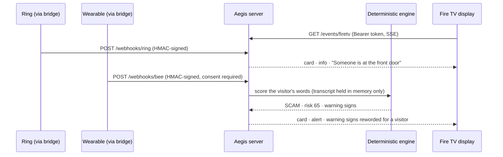

# Aegis ecosystem pipeline: Ring → wearable → Fire TV (simulator-grade)

**Status:** Implemented and tested against Aegis's own simulator (`scripts/simulate_ecosystem_event.py`). **Not connected to real Ring, Bee or Fire TV devices.** The payload formats below are **Aegis-defined bridge formats**. Ring *does* publish a partner API with HMAC-signed webhooks ([developer.amazon.com/docs/ring](https://developer.amazon.com/docs/ring/get-started.html)), which Aegis hasn't adopted yet. Fire TV pushes from a server go through Amazon Device Messaging to a Fire TV app, which isn't built. We found no Bee developer API in the Amazon developer docs.
**Code:** `server/ecosystem/`. Engine rules are unchanged: verdicts come only from `aegis/engine.py`.

## Flow



A **visit** opens on a doorbell or motion event and lasts 2 minutes. Wearable context only counts inside an open visit. The visit state machine (`VISIT_TRANSITIONS`) allows `OPEN → ASSESSED → ASSESSED … → CLOSED`. A new doorbell closes the old visit. If later speech is benign, the riskier earlier assessment still stands.

## Decisions (2026-10-04)

| Topic | Decision | Why |
|---|---|---|
| Who judges threats | **The deterministic engine.** Bedrock/Strands may at most phrase text, and isn't wired in. | Keeps `no_llm_verdicts`. The full chain runs in about 1 ms, far inside the 200 ms target. |
| Wearable audio | **Text only**, refused unless `consent.all_parties_consented` is `true`. Never stored, logged or shown; cards carry the engine's warning-sign sentences, not what was said. The wearer's own speech is ignored. | Recording visitors can require everyone's consent (two-party-consent states). |
| Inbound auth | HMAC-SHA256 over `"<timestamp>." + body` in `X-Aegis-Signature: v1=…`, 5-minute clock skew, `event_id` replay rejection (409), 16 KiB cap, 5 s body deadline. | Unsigned webhooks would let anyone push fake "alerts" (for example a callback number) to an older adult's TV. |
| Display auth | `Authorization: Bearer <AEGIS_DISPLAY_TOKEN>` on the SSE stream; at most 8 displays; slow displays drop their oldest cards. | Door activity is sensitive ("nobody's home"). |
| Card buttons | Only `ask_alexa` and `dismiss`. **No button blocks, reports or approves anything**; actions still need the spoken read-back and "yes". | Keeps the permission layer intact. |
| MCP tools | Unchanged. Still exactly the five agreed tools. | `[tool.aegis.mcp_server] tools` |

## Running it

```bash
export AEGIS_WEBHOOK_SECRET="$(python -c 'import secrets; print(secrets.token_urlsafe(32))')"
export AEGIS_DISPLAY_TOKEN="$(python -c 'import secrets; print(secrets.token_urlsafe(32))')"
aegis-server                                         # mounts /webhooks/ring, /webhooks/bee, /events/firetv
python scripts/simulate_ecosystem_event.py --scenario scam     # or: --scenario benign
```

The endpoints are mounted **only when both secrets are set**, each at least 32 characters. Otherwise they return 404.

Sample simulator output:

```
OK  Ring doorbell press                          HTTP 202     1.4 ms
OK  Bee context -> assessment -> Fire TV card    HTTP 202     1.1 ms
    Fire TV card [info   ] Someone is at the front door
    Fire TV card [alert  ] Warning: this visitor sounds like a scam  (SCAM, risk 65)
        - The visitor wants payment by gift card, wire transfer or cryptocurrency. Real agencies never ask for that.
        - The visitor asks you to keep this secret. Scammers do that so your family can't warn you.
        - The visitor is rushing you. Scammers want you to act before you can check.
```

## Schemas

Defined in `server/ecosystem/schemas.py` (JSON Schema 2020-12, closed objects):
- `aegis.ring.event/v1`: `event_type` (`doorbell_press` or `motion`), `device.location`, `occurred_at` (with a time zone).
- `aegis.wearable.context/v1`: `consent`, `speaker` (`other`, `wearer` or `unknown`), `language` (`en`), and `transcript` (1–2000 characters, no audio).
- `aegis.firetv.card/v1`: `severity` (`info`, `caution` or `alert`), `title`, `body`, `evidence` (at most 3), `threat` (or null), `buttons`, and `simulated: true`.

## Not done (needs real integrations)

- Native Ring webhooks: the v1.1 payload (`meta.request_id`, `data.type` such as `button_press` or `motion_detected`), `X-Signature` HMAC-SHA256 verification, and a 200 reply within 5 seconds.
- A Fire TV app (Fire OS or Vega OS) that receives cards through Amazon Device Messaging and shows them as heads-up notifications.
- Bee data access, if a developer API becomes available.
- A Fire TV (Vega / Fire OS) app that subscribes to `/events/firetv` and renders the card.
- Persistence: visits, seen event ids and subscribers live in memory, like the approval ledger.
